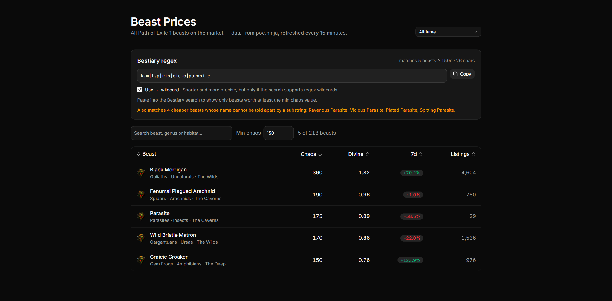

# PoE Beast Prices

Every Path of Exile 1 beast currently on the market, sortable by value, plus a
generated Bestiary search pattern for the ones worth farming.



## What it does

- Lists **all** beasts for the selected league with Chaos value, Divine value,
  7-day change and listing count.
- Sort by any column, search by beast name, genus or habitat.
- **Min chaos filter** — hide everything below a threshold.
- **Bestiary regex** — a search pattern matching exactly the beasts above that
  threshold, ready to paste into the in-game Bestiary window.

## Data

Prices come from the [poe.ninja economy API](https://poe.ninja/docs/api)
(`/poe1/api/economy/...`). Requests happen server-side with a descriptive
User-Agent and are cached for 15 minutes, which is roughly how often poe.ninja
refreshes PoE 1 overviews.

## The Bestiary regex

The in-game search is a case-insensitive regex over the beast name, so the
generated pattern is an alternation of short name fragments:

```
k.m|l.p|parasite        # everything worth 150c or more
```

Each fragment is chosen so it appears in **no** beast below the threshold.
Picking the smallest such set is set cover, so `src/lib/bestiary-regex.ts` uses
the greedy approximation: repeatedly take the fragment covering the most
still-uncovered beasts.

### No literal spaces

An early version emitted fragments like `l p` (spanning the word break in
"Fenuma**l P**lagued Arachnid"). In game those pulled in beasts that share no
substring with the target at all — `l p` matched "Sulphuric Scorpion", and
"Scum Crawler" showed up too. The search field does not treat a space as a
literal character, so word breaks now travel as a `.` wildcard instead.

That leaves two modes, toggled in the UI:

| Mode | Example (150c) | Chars | Extra beasts |
| --- | --- | --- | --- |
| Plain substrings | `iga\|arachnid\|parasite` | 21 | 9 |
| `.` wildcard | `k.m\|l.p\|parasite` | 16 | 4 |

Plain mode never relies on regex support of any kind; wildcard mode is shorter
and much more selective. Neither ever misses a beast above the threshold.

Two more things the UI tells you about instead of hiding:

- **Length.** The search field takes 250 characters. Longer patterns get cut off.
- **Over-matching.** When a wanted name is fully contained in a cheaper one
  (`Parasite` inside `Plated Parasite`), no substring can separate them. The
  pattern keeps the wanted beast and the UI names the extras you'll also see.

## Development

```bash
pnpm install
pnpm dev      # http://localhost:3000
pnpm test     # regex tests against a real 218-beast fixture
pnpm build
```

Tests run on `node --test` with Node's built-in TypeScript stripping — no test
framework needed. They assert the generated pattern never misses a wanted beast
at several thresholds, and that every false positive is one the caller was
warned about.

## Stack

Next.js 16 (App Router), React 19, Tailwind v4, shadcn/ui, TypeScript.
